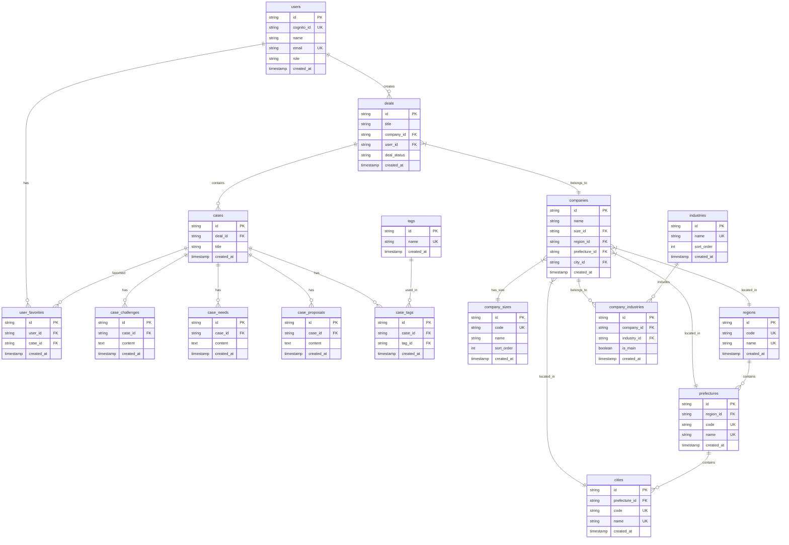

# 営業支援システム データベース設計書（最終版）

## システム構成
- **バックエンド**: FastAPI (Python) + Next.js API Routes
- **フロントエンド**: Next.js (TypeScript)
- **認証**: AWS Cognito
- **データベース**: MySQL 8.0
- **AI処理**: FastAPI（商談データ保存も含む）

## テーブル一覧

### **users（ユーザー）**

| カラム名 | データ型 | 制約 | 説明 |
| --- | --- | --- | --- |
| id | VARCHAR(36) | PRIMARY KEY | UUID |
| cognito_id | VARCHAR(255) | UNIQUE, NOT NULL | Cognito ID  |
| name | VARCHAR(100) | NOT NULL  | ユーザー名 |
| email | VARCHAR(255) | UNIQUE, NOT NULL | メールアドレス |
| role | VARCHAR(20) | NOT NULL | 権限(admin, user) |
| created_at | TIMESTAMP | DEFAULT CURRENT_TIMESTAMP | 作成日時 |

### **companies（会社）**

| カラム名 | データ型 | 制約 | 説明 |
| --- | --- | --- | --- |
| id | VARCHAR(36) | PRIMARY KEY | UUID |
| name | VARCHAR(255) | NOT NULL | 会社名 |
| size_id | VARCHAR(36) | FOREIGN KEY | 規模ID |
| region_id | VARCHAR(36) | FOREIGN KEY | 地域ID |
| prefecture_id | VARCHAR(36) | FOREIGN KEY | 都道府県ID |
| city_id | VARCHAR(36) | FOREIGN KEY | 市区町村ID |
| created_at | TIMESTAMP | DEFAULT CURRENT_TIMESTAMP | 作成日時 |

### **company_sizes（会社規模マスター)**

| カラム名 | データ型 | 制約 | 説明 |
| --- | --- | --- | --- |
| id | VARCHAR(36) | PRIMARY KEY | UUID |
| code | VARCHAR(20) | UNIQUE, NOT NULL | 規模コード |
| name | VARCHAR(50) | NOT NULL | 規模名称 |
| sort_order | INT | DEFAULT 0 | 表示順 |
| created_at | TIMESTAMP | DEFAULT CURRENT_TIMESTAMP | 作成日時 |

### **deals（商談）**

| カラム名 | データ型 | 制約 | 説明 |
| --- | --- | --- | --- |
| id | VARCHAR(36) | PRIMARY KEY | UUID |
| title | VARCHAR(255) | NOT NULL | 商談タイトル |
| company_id | VARCHAR(36) | FOREIGN KEY | 会社ID |
| user_id | VARCHAR(36) | FOREIGN KEY | 作成者ID |
| deal_status | VARCHAR(20) |  NOT NULL | 商談状況(won, lost, in_progress) |
| created_at | TIMESTAMP | DEFAULT CURRENT_TIMESTAMP | 作成日時 |

### **cases（事例）**

| カラム名 | データ型 | 制約 | 説明 |
| --- | --- | --- | --- |
| id | VARCHAR(36) | PRIMARY KEY | UUID |
| deal_id | VARCHAR(36)   | FOREIGN KEY   | 商談ID   |
| title | VARCHAR(255)  | NOT NULL | 事例タイトル |
| created_at | TIMESTAMP | DEFAULT CURRENT_TIMESTAMP | 作成日時 |

### **case_challenges（事例課題）**

| カラム名 | データ型 | 制約 | 説明 |
| --- | --- | --- | --- |
| id | VARCHAR(36) | PRIMARY KEY | UUID |
| case_id | VARCHAR(36)  | FOREIGN KEY | 事例ID |
| content | TEXT | NOT NULL | 課題内容 |
| created_at | TIMESTAMP | DEFAULT CURRENT_TIMESTAMP | 作成日時 |

### **case_needs（事例ニーズ）**

| カラム名 | データ型 | 制約 | 説明 |
| --- | --- | --- | --- |
| id | VARCHAR(36) | PRIMARY KEY | UUID |
| case_id | VARCHAR(36)  | FOREIGN KEY | 事例ID |
| content | TEXT | NOT NULL | ニーズ内容 |
| created_at | TIMESTAMP | DEFAULT CURRENT_TIMESTAMP | 作成日時 |

### **case_proposals（事例提案）**

| カラム名 | データ型 | 制約 | 説明 |
| --- | --- | --- | --- |
| id | VARCHAR(36) | PRIMARY KEY | UUID |
| case_id | VARCHAR(36)  | FOREIGN KEY | 事例ID |
| content | TEXT | NOT NULL | 提案内容 |
| created_at | TIMESTAMP | DEFAULT CURRENT_TIMESTAMP | 作成日時 |

### **user_favorites（お気に入り）**

| カラム名 | データ型 | 制約 | 説明 |
| --- | --- | --- | --- |
| id | VARCHAR(36) | PRIMARY KEY | UUID |
| user_id | VARCHAR(36)  | FOREIGN KEY | ユーザーID |
| case_id | VARCHAR(36)  | FOREIGN KEY | 事例ID |
| created_at | TIMESTAMP | DEFAULT CURRENT_TIMESTAMP | 作成日時 |

### **industries（業種）**

| カラム名 | データ型 | 制約 | 説明 |
| --- | --- | --- | --- |
| id | VARCHAR(36) | PRIMARY KEY | UUID |
| name | VARCHAR(100) | UNIQUE, NOT NULL | 業種名 |
| sort_order | INT | DEFAULT 0 | 表示順 |
| created_at | TIMESTAMP | DEFAULT CURRENT_TIMESTAMP | 作成日時 |

### **company_industries（会社業種関連）**

| カラム名 | データ型 | 制約 | 説明 |
| --- | --- | --- | --- |
| id | VARCHAR(36) | PRIMARY KEY | UUID |
| company_id | VARCHAR(36) | FOREIGN KEY | 会社ID |
| industry_id | VARCHAR(36) | FOREIGN KEY | 業種ID |
| is_main | BOOLEAN | DEFAULT FALSE | 主要業種フラグ |
| created_at | TIMESTAMP | DEFAULT CURRENT_TIMESTAMP | 作成日時 |

### **tags（タグ）**

| カラム名 | データ型 | 制約 | 説明 |
| --- | --- | --- | --- |
| id | VARCHAR(36) | PRIMARY KEY | UUID |
| name | VARCHAR(50) | UNIQUE, NOT NULL | タグ名 |
| created_at | TIMESTAMP | DEFAULT CURRENT_TIMESTAMP | 作成日時 |

### **case_tags（事例タグ関連）**

| カラム名 | データ型 | 制約 | 説明 |
| --- | --- | --- | --- |
| id | VARCHAR(36) | PRIMARY KEY | UUID |
| case_id | VARCHAR(36)  | FOREIGN KEY | 事例ID |
| tag_id | VARCHAR(36)  | FOREIGN KEY | タグID |
| created_at | TIMESTAMP | DEFAULT CURRENT_TIMESTAMP | 作成日時 |

### **regions（地域）**

| カラム名 | データ型 | 制約 | 説明 |
| --- | --- | --- | --- |
| id | VARCHAR(36) | PRIMARY KEY | UUID |
| code | VARCHAR(10) | UNIQUE, NOT NULL | 地域コード |
| name | VARCHAR(50)  | UNIQUE, NOT NULL | 地域名 |
| created_at | TIMESTAMP | DEFAULT CURRENT_TIMESTAMP | 作成日時 |

### **prefectures（都道府県）**

| カラム名 | データ型 | 制約 | 説明 |
| --- | --- | --- | --- |
| id | VARCHAR(36) | PRIMARY KEY | UUID |
| region_id | VARCHAR(36) | FOREIGN KEY | 地域ID |
| code | VARCHAR(10) | UNIQUE, NOT NULL | 都道府県コード |
| name | VARCHAR(50)  | UNIQUE, NOT NULL | 都道府県名 |
| created_at | TIMESTAMP | DEFAULT CURRENT_TIMESTAMP | 作成日時 |

### **cities（市区町村）**

| カラム名 | データ型 | 制約 | 説明 |
| --- | --- | --- | --- |
| id | VARCHAR(36) | PRIMARY KEY | UUID |
| prefecture_id | VARCHAR(36) | FOREIGN KEY | 都道府県ID |
| code | VARCHAR(10) | UNIQUE, NOT NULL | 市区町村コード |
| name | VARCHAR(50)  | UNIQUE, NOT NULL | 市区町村名 |
| created_at | TIMESTAMP | DEFAULT CURRENT_TIMESTAMP | 作成日時 |

## ER図



## データ制約

### 外部キー制約
```sql
-- メインテーブル
ALTER TABLE deals ADD FOREIGN KEY (company_id) REFERENCES companies(id);
ALTER TABLE deals ADD FOREIGN KEY (user_id) REFERENCES users(id);
ALTER TABLE cases ADD FOREIGN KEY (deal_id) REFERENCES deals(id) ON DELETE CASCADE;

-- 会社関連
ALTER TABLE companies ADD FOREIGN KEY (size_id) REFERENCES company_sizes(id);
ALTER TABLE companies ADD FOREIGN KEY (region_id) REFERENCES regions(id);
ALTER TABLE companies ADD FOREIGN KEY (prefecture_id) REFERENCES prefectures(id);
ALTER TABLE companies ADD FOREIGN KEY (city_id) REFERENCES cities(id);

-- 地域階層
ALTER TABLE prefectures ADD FOREIGN KEY (region_id) REFERENCES regions(id);
ALTER TABLE cities ADD FOREIGN KEY (prefecture_id) REFERENCES prefectures(id);

-- 事例詳細
ALTER TABLE case_challenges ADD FOREIGN KEY (case_id) REFERENCES cases(id) ON DELETE CASCADE;
ALTER TABLE case_needs ADD FOREIGN KEY (case_id) REFERENCES cases(id) ON DELETE CASCADE;
ALTER TABLE case_proposals ADD FOREIGN KEY (case_id) REFERENCES cases(id) ON DELETE CASCADE;

-- 関連テーブル
ALTER TABLE company_industries ADD FOREIGN KEY (company_id) REFERENCES companies(id) ON DELETE CASCADE;
ALTER TABLE company_industries ADD FOREIGN KEY (industry_id) REFERENCES industries(id);
ALTER TABLE case_tags ADD FOREIGN KEY (case_id) REFERENCES cases(id) ON DELETE CASCADE;
ALTER TABLE case_tags ADD FOREIGN KEY (tag_id) REFERENCES tags(id);
ALTER TABLE user_favorites ADD FOREIGN KEY (user_id) REFERENCES users(id) ON DELETE CASCADE;
ALTER TABLE user_favorites ADD FOREIGN KEY (case_id) REFERENCES cases(id) ON DELETE CASCADE;
```

### チェック制約
```sql
-- 商談状況制約
ALTER TABLE deals ADD CONSTRAINT chk_deal_status 
CHECK (deal_status IN ('won', 'lost', 'in_progress'));

-- ユーザー権限制約
ALTER TABLE users ADD CONSTRAINT chk_user_role 
CHECK (role IN ('admin', 'user'));
```

### ユニーク制約
```sql
-- 重複防止
ALTER TABLE company_industries ADD UNIQUE KEY uk_company_industry (company_id, industry_id);
ALTER TABLE case_tags ADD UNIQUE KEY uk_case_tag (case_id, tag_id);
ALTER TABLE user_favorites ADD UNIQUE KEY uk_user_case (user_id, case_id);
```

## インデックス設計

### 基本インデックス
```sql
-- 検索性能向上
CREATE INDEX idx_deals_status ON deals(deal_status);
CREATE INDEX idx_deals_created_at ON deals(created_at DESC);
CREATE INDEX idx_deals_user_id ON deals(user_id);
CREATE INDEX idx_deals_company_id ON deals(company_id);

CREATE INDEX idx_cases_deal_id ON cases(deal_id);
CREATE INDEX idx_cases_title ON cases(title);

CREATE INDEX idx_companies_size_id ON companies(size_id);
CREATE INDEX idx_companies_region_id ON companies(region_id);
CREATE INDEX idx_companies_prefecture_id ON companies(prefecture_id);
CREATE INDEX idx_companies_city_id ON companies(city_id);

CREATE INDEX idx_user_favorites_user_id ON user_favorites(user_id);
CREATE INDEX idx_case_tags_case_id ON case_tags(case_id);
CREATE INDEX idx_case_tags_tag_id ON case_tags(tag_id);

CREATE INDEX idx_case_challenges_case_id ON case_challenges(case_id);
CREATE INDEX idx_case_needs_case_id ON case_needs(case_id);
CREATE INDEX idx_case_proposals_case_id ON case_proposals(case_id);

CREATE INDEX idx_company_industries_company_id ON company_industries(company_id);
CREATE INDEX idx_company_industries_industry_id ON company_industries(industry_id);
```

### 全文検索インデックス
```sql
-- MySQL 8.0 全文検索
CREATE FULLTEXT INDEX idx_deals_title_fulltext ON deals(title);
CREATE FULLTEXT INDEX idx_cases_title_fulltext ON cases(title);
CREATE FULLTEXT INDEX idx_case_challenges_content_fulltext ON case_challenges(content);
CREATE FULLTEXT INDEX idx_case_needs_content_fulltext ON case_needs(content);
CREATE FULLTEXT INDEX idx_case_proposals_content_fulltext ON case_proposals(content);
```

## FastAPI連携最適化

### 検索用ビュー
```sql
-- 商談一覧取得用ビュー
CREATE VIEW v_deals_list AS
SELECT 
    d.id,
    d.title,
    d.deal_status,
    d.created_at,
    c.name as company_name,
    cs.name as company_size,
    r.name as region_name,
    p.name as prefecture_name,
    city.name as city_name,
    u.name as user_name,
    GROUP_CONCAT(DISTINCT i.name) as industries,
    COUNT(DISTINCT cases.id) as case_count,
    COUNT(DISTINCT uf.user_id) as favorite_count
FROM deals d
LEFT JOIN companies c ON d.company_id = c.id
LEFT JOIN company_sizes cs ON c.size_id = cs.id
LEFT JOIN regions r ON c.region_id = r.id
LEFT JOIN prefectures p ON c.prefecture_id = p.id
LEFT JOIN cities city ON c.city_id = city.id
LEFT JOIN users u ON d.user_id = u.id
LEFT JOIN company_industries ci ON c.id = ci.company_id
LEFT JOIN industries i ON ci.industry_id = i.id
LEFT JOIN cases ON d.id = cases.deal_id
LEFT JOIN user_favorites uf ON cases.id = uf.case_id
GROUP BY d.id;
```

## データ移行

### 現在のmockCasesからの移行マッピング
```typescript
// 現在のCase型 → 新しいDB構造
interface Case {
  id: string;           → deals.id
  title: string;        → deals.title
  companyName: string;  → companies.name
  industry: string;     → company_industries.industry_id
  region: string;       → companies.region_id
  orderStatus: string;  → deals.deal_status
  challenges: string[]; → case_challenges.content (複数行)
  needs: string[];      → case_needs.content (複数行)
  proposals: string[];  → case_proposals.content (複数行)
  tags: string[];       → case_tags (tags経由)
}
```

## セキュリティ考慮事項

1. **認証**: AWS Cognito統合
2. **認可**: ユーザーロールベースアクセス制御
3. **データ暗号化**: 機密情報の暗号化
4. **監査ログ**: 操作履歴の記録
5. **バックアップ**: 定期バックアップとリストア戦略

この設計により、FastAPI-Next.js構成での高性能な営業支援システムが実現できます。