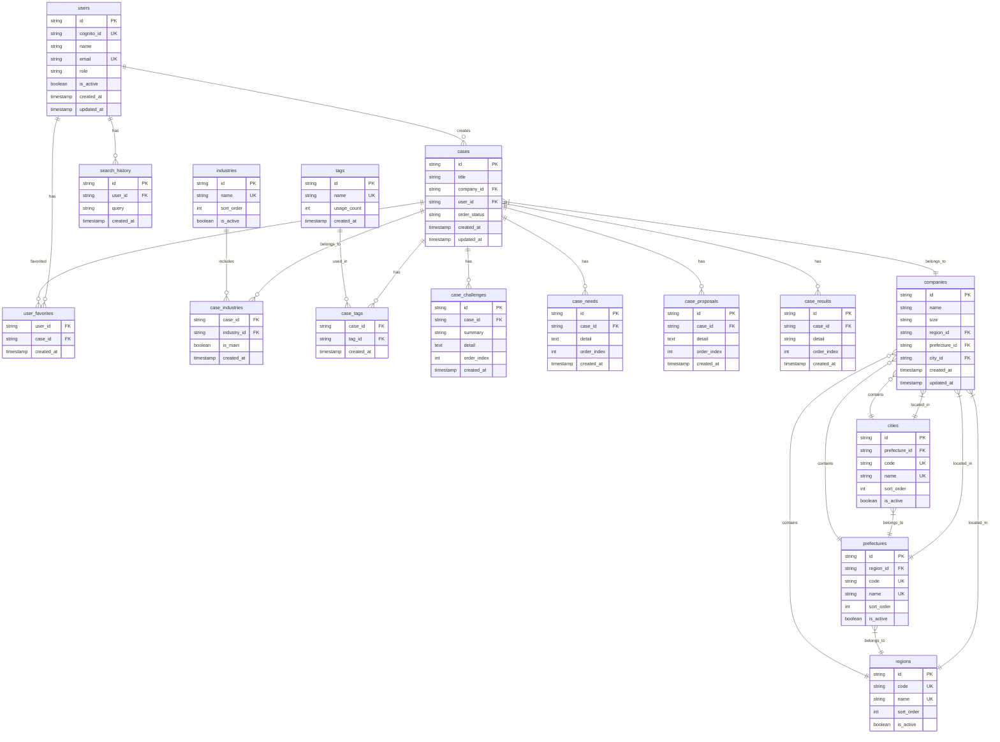

# データベース設計書（修正版）
**FastAPI + Next.js 構成対応**

## システム構成
- **バックエンド**: FastAPI (Python)
- **フロントエンド**: Next.js (TypeScript)
- **認証**: AWS Cognito
- **データベース**: MySQL 8.0
- **データ連携**: FastAPI → Next.js (REST API)

## ER図



## テーブル設計詳細

### 1. users（ユーザー）
AWS Cognito連携ユーザー管理

| カラム名 | データ型 | 制約 | 説明 |
|---------|---------|------|------|
| id | VARCHAR(36) | PRIMARY KEY | UUID |
| cognito_id | VARCHAR(255) | UNIQUE, NOT NULL | Cognito ID |
| name | VARCHAR(100) | NOT NULL | ユーザー名 |
| email | VARCHAR(255) | UNIQUE, NOT NULL | メールアドレス |
| role | VARCHAR(20) | NOT NULL | 権限(admin, user) |
| is_active | BOOLEAN | DEFAULT TRUE | アクティブ状態 |
| created_at | TIMESTAMP | DEFAULT CURRENT_TIMESTAMP | 作成日時 |
| updated_at | TIMESTAMP | DEFAULT CURRENT_TIMESTAMP ON UPDATE CURRENT_TIMESTAMP | 更新日時 |

### 2. companies（会社）
顧客企業情報

| カラム名 | データ型 | 制約 | 説明 |
|---------|---------|------|------|
| id | VARCHAR(36) | PRIMARY KEY | UUID |
| name | VARCHAR(255) | NOT NULL | 会社名 |
| size | VARCHAR(20) | NOT NULL | 会社規模(small, medium, large) |
| region_id | VARCHAR(36) | FOREIGN KEY | 地域ID |
| prefecture_id | VARCHAR(36) | FOREIGN KEY | 都道府県ID |
| city_id | VARCHAR(36) | FOREIGN KEY | 市区町村ID |
| created_at | TIMESTAMP | DEFAULT CURRENT_TIMESTAMP | 作成日時 |
| updated_at | TIMESTAMP | DEFAULT CURRENT_TIMESTAMP ON UPDATE CURRENT_TIMESTAMP | 更新日時 |

### 3. cases（事例）
営業事例の基本情報

| カラム名 | データ型 | 制約 | 説明 |
|---------|---------|------|------|
| id | VARCHAR(36) | PRIMARY KEY | UUID |
| title | VARCHAR(255) | NOT NULL | 事例タイトル |
| company_id | VARCHAR(36) | FOREIGN KEY | 会社ID |
| user_id | VARCHAR(36) | FOREIGN KEY | 作成者ID |
| order_status | VARCHAR(20) | NOT NULL | 受注状況(won, lost, in_progress) |
| created_at | TIMESTAMP | DEFAULT CURRENT_TIMESTAMP | 作成日時 |
| updated_at | TIMESTAMP | DEFAULT CURRENT_TIMESTAMP ON UPDATE CURRENT_TIMESTAMP | 更新日時 |

### 4. case_challenges（事例課題）
事例の課題詳細情報

| カラム名 | データ型 | 制約 | 説明 |
|---------|---------|------|------|
| id | VARCHAR(36) | PRIMARY KEY | UUID |
| case_id | VARCHAR(36) | FOREIGN KEY | 事例ID |
| summary | VARCHAR(255) | NOT NULL | 課題要約 |
| detail | TEXT | NOT NULL | 課題詳細 |
| order_index | INT | DEFAULT 0 | 表示順 |
| created_at | TIMESTAMP | DEFAULT CURRENT_TIMESTAMP | 作成日時 |

### 5. case_needs（事例ニーズ）
事例のニーズ詳細情報

| カラム名 | データ型 | 制約 | 説明 |
|---------|---------|------|------|
| id | VARCHAR(36) | PRIMARY KEY | UUID |
| case_id | VARCHAR(36) | FOREIGN KEY | 事例ID |
| detail | TEXT | NOT NULL | ニーズ詳細 |
| order_index | INT | DEFAULT 0 | 表示順 |
| created_at | TIMESTAMP | DEFAULT CURRENT_TIMESTAMP | 作成日時 |

### 6. case_proposals（事例提案）
事例の提案詳細情報

| カラム名 | データ型 | 制約 | 説明 |
|---------|---------|------|------|
| id | VARCHAR(36) | PRIMARY KEY | UUID |
| case_id | VARCHAR(36) | FOREIGN KEY | 事例ID |
| detail | TEXT | NOT NULL | 提案詳細 |
| order_index | INT | DEFAULT 0 | 表示順 |
| created_at | TIMESTAMP | DEFAULT CURRENT_TIMESTAMP | 作成日時 |

### 7. case_results（事例結果）
事例の結果詳細情報

| カラム名 | データ型 | 制約 | 説明 |
|---------|---------|------|------|
| id | VARCHAR(36) | PRIMARY KEY | UUID |
| case_id | VARCHAR(36) | FOREIGN KEY | 事例ID |
| detail | VARCHAR(255) | NOT NULL | 結果詳細 |
| order_index | INT | DEFAULT 0 | 表示順 |
| created_at | TIMESTAMP | DEFAULT CURRENT_TIMESTAMP | 作成日時 |

### 8. search_history（検索履歴）
ユーザーの検索履歴

| カラム名 | データ型 | 制約 | 説明 |
|---------|---------|------|------|
| id | VARCHAR(36) | PRIMARY KEY | UUID |
| user_id | VARCHAR(36) | FOREIGN KEY | ユーザーID |
| query | VARCHAR(500) | NOT NULL | 検索クエリ |
| created_at | TIMESTAMP | DEFAULT CURRENT_TIMESTAMP | 作成日時 |

### 9. user_favorites（お気に入り）
ユーザーのお気に入り事例

| カラム名 | データ型 | 制約 | 説明 |
|---------|---------|------|------|
| user_id | VARCHAR(36) | FOREIGN KEY | ユーザーID |
| case_id | VARCHAR(36) | FOREIGN KEY | 事例ID |
| created_at | TIMESTAMP | DEFAULT CURRENT_TIMESTAMP | 作成日時 |

**複合主キー**: (user_id, case_id)

### 10. industries（業種）
業種マスター

| カラム名 | データ型 | 制約 | 説明 |
|---------|---------|------|------|
| id | VARCHAR(36) | PRIMARY KEY | UUID |
| name | VARCHAR(100) | UNIQUE, NOT NULL | 業種名 |
| sort_order | INT | DEFAULT 0 | 表示順 |
| is_active | BOOLEAN | DEFAULT TRUE | アクティブ状態 |

### 11. case_industries（事例業種関連）
事例と業種の多対多関係

| カラム名 | データ型 | 制約 | 説明 |
|---------|---------|------|------|
| case_id | VARCHAR(36) | FOREIGN KEY | 事例ID |
| industry_id | VARCHAR(36) | FOREIGN KEY | 業種ID |
| is_main | BOOLEAN | DEFAULT FALSE | 主要業種フラグ |
| created_at | TIMESTAMP | DEFAULT CURRENT_TIMESTAMP | 作成日時 |

**複合主キー**: (case_id, industry_id)

### 12. tags（タグ）
タグマスター（使用回数カウント付き）

| カラム名 | データ型 | 制約 | 説明 |
|---------|---------|------|------|
| id | VARCHAR(36) | PRIMARY KEY | UUID |
| name | VARCHAR(50) | UNIQUE, NOT NULL | タグ名 |
| usage_count | INT | DEFAULT 0 | 使用回数 |
| created_at | TIMESTAMP | DEFAULT CURRENT_TIMESTAMP | 作成日時 |

### 13. case_tags（事例タグ関連）
事例とタグの多対多関係

| カラム名 | データ型 | 制約 | 説明 |
|---------|---------|------|------|
| case_id | VARCHAR(36) | FOREIGN KEY | 事例ID |
| tag_id | VARCHAR(36) | FOREIGN KEY | タグID |
| created_at | TIMESTAMP | DEFAULT CURRENT_TIMESTAMP | 作成日時 |

**複合主キー**: (case_id, tag_id)

### 14. regions（地域）
地域マスター

| カラム名 | データ型 | 制約 | 説明 |
|---------|---------|------|------|
| id | VARCHAR(36) | PRIMARY KEY | UUID |
| code | VARCHAR(10) | UNIQUE, NOT NULL | 地域コード |
| name | VARCHAR(50) | UNIQUE, NOT NULL | 地域名 |
| sort_order | INT | DEFAULT 0 | 表示順 |
| is_active | BOOLEAN | DEFAULT TRUE | アクティブ状態 |

### 15. prefectures（都道府県）
都道府県マスター

| カラム名 | データ型 | 制約 | 説明 |
|---------|---------|------|------|
| id | VARCHAR(36) | PRIMARY KEY | UUID |
| region_id | VARCHAR(36) | FOREIGN KEY | 地域ID |
| code | VARCHAR(10) | UNIQUE, NOT NULL | 都道府県コード |
| name | VARCHAR(50) | UNIQUE, NOT NULL | 都道府県名 |
| sort_order | INT | DEFAULT 0 | 表示順 |
| is_active | BOOLEAN | DEFAULT TRUE | アクティブ状態 |

### 16. cities（市区町村）
市区町村マスター

| カラム名 | データ型 | 制約 | 説明 |
|---------|---------|------|------|
| id | VARCHAR(36) | PRIMARY KEY | UUID |
| prefecture_id | VARCHAR(36) | FOREIGN KEY | 都道府県ID |
| code | VARCHAR(10) | UNIQUE, NOT NULL | 市区町村コード |
| name | VARCHAR(100) | UNIQUE, NOT NULL | 市区町村名 |
| sort_order | INT | DEFAULT 0 | 表示順 |
| is_active | BOOLEAN | DEFAULT TRUE | アクティブ状態 |

## インデックス設計

### 基本インデックス
```sql
-- ユーザー検索用
CREATE INDEX idx_users_cognito_id ON users(cognito_id);
CREATE INDEX idx_users_email ON users(email);
CREATE INDEX idx_users_is_active ON users(is_active);

-- 事例検索用（FastAPI高速化）
CREATE INDEX idx_cases_order_status ON cases(order_status);
CREATE INDEX idx_cases_created_at ON cases(created_at DESC);
CREATE INDEX idx_cases_user_id ON cases(user_id);
CREATE INDEX idx_cases_company_id ON cases(company_id);
CREATE INDEX idx_cases_title ON cases(title);

-- 会社検索用
CREATE INDEX idx_companies_region_id ON companies(region_id);
CREATE INDEX idx_companies_prefecture_id ON companies(prefecture_id);
CREATE INDEX idx_companies_city_id ON companies(city_id);
CREATE INDEX idx_companies_size ON companies(size);
CREATE INDEX idx_companies_name ON companies(name);

-- 検索履歴用
CREATE INDEX idx_search_history_user_id ON search_history(user_id);
CREATE INDEX idx_search_history_created_at ON search_history(created_at DESC);

-- お気に入り用
CREATE INDEX idx_user_favorites_user_id ON user_favorites(user_id);
CREATE INDEX idx_user_favorites_case_id ON user_favorites(case_id);

-- タグ検索用
CREATE INDEX idx_case_tags_case_id ON case_tags(case_id);
CREATE INDEX idx_case_tags_tag_id ON case_tags(tag_id);
CREATE INDEX idx_tags_name ON tags(name);
CREATE INDEX idx_tags_usage_count ON tags(usage_count DESC);

-- 業種検索用
CREATE INDEX idx_case_industries_case_id ON case_industries(case_id);
CREATE INDEX idx_case_industries_industry_id ON case_industries(industry_id);
CREATE INDEX idx_case_industries_main ON case_industries(is_main);

-- 事例詳細検索用
CREATE INDEX idx_case_challenges_case_id ON case_challenges(case_id);
CREATE INDEX idx_case_needs_case_id ON case_needs(case_id);
CREATE INDEX idx_case_proposals_case_id ON case_proposals(case_id);
CREATE INDEX idx_case_results_case_id ON case_results(case_id);

-- 地域階層検索用
CREATE INDEX idx_prefectures_region_id ON prefectures(region_id);
CREATE INDEX idx_cities_prefecture_id ON cities(prefecture_id);
```

### 複合インデックス（API最適化）
```sql
-- FastAPI検索性能向上用
CREATE INDEX idx_cases_status_created ON cases(order_status, created_at DESC);
CREATE INDEX idx_cases_user_status ON cases(user_id, order_status);
CREATE INDEX idx_companies_location ON companies(region_id, prefecture_id, city_id);
CREATE INDEX idx_case_industries_main_industry ON case_industries(is_main, industry_id);
CREATE INDEX idx_search_history_user_created ON search_history(user_id, created_at DESC);

-- 全文検索用（MySQL 8.0）
CREATE FULLTEXT INDEX idx_cases_title_fulltext ON cases(title);
CREATE FULLTEXT INDEX idx_case_challenges_detail_fulltext ON case_challenges(detail);
CREATE FULLTEXT INDEX idx_case_needs_detail_fulltext ON case_needs(detail);
CREATE FULLTEXT INDEX idx_case_proposals_detail_fulltext ON case_proposals(detail);
```

## データ整合性制約

### 外部キー制約
```sql
-- ユーザー関連
ALTER TABLE cases ADD FOREIGN KEY (user_id) REFERENCES users(id) ON DELETE CASCADE;
ALTER TABLE search_history ADD FOREIGN KEY (user_id) REFERENCES users(id) ON DELETE CASCADE;
ALTER TABLE user_favorites ADD FOREIGN KEY (user_id) REFERENCES users(id) ON DELETE CASCADE;

-- 事例関連
ALTER TABLE cases ADD FOREIGN KEY (company_id) REFERENCES companies(id) ON DELETE CASCADE;
ALTER TABLE case_challenges ADD FOREIGN KEY (case_id) REFERENCES cases(id) ON DELETE CASCADE;
ALTER TABLE case_needs ADD FOREIGN KEY (case_id) REFERENCES cases(id) ON DELETE CASCADE;
ALTER TABLE case_proposals ADD FOREIGN KEY (case_id) REFERENCES cases(id) ON DELETE CASCADE;
ALTER TABLE case_results ADD FOREIGN KEY (case_id) REFERENCES cases(id) ON DELETE CASCADE;
ALTER TABLE case_industries ADD FOREIGN KEY (case_id) REFERENCES cases(id) ON DELETE CASCADE;
ALTER TABLE case_tags ADD FOREIGN KEY (case_id) REFERENCES cases(id) ON DELETE CASCADE;
ALTER TABLE user_favorites ADD FOREIGN KEY (case_id) REFERENCES cases(id) ON DELETE CASCADE;

-- 会社-地域関連
ALTER TABLE companies ADD FOREIGN KEY (region_id) REFERENCES regions(id);
ALTER TABLE companies ADD FOREIGN KEY (prefecture_id) REFERENCES prefectures(id);
ALTER TABLE companies ADD FOREIGN KEY (city_id) REFERENCES cities(id);

-- 地域階層
ALTER TABLE prefectures ADD FOREIGN KEY (region_id) REFERENCES regions(id);
ALTER TABLE cities ADD FOREIGN KEY (prefecture_id) REFERENCES prefectures(id);

-- マスター関連
ALTER TABLE case_industries ADD FOREIGN KEY (industry_id) REFERENCES industries(id);
ALTER TABLE case_tags ADD FOREIGN KEY (tag_id) REFERENCES tags(id);
```

### チェック制約
```sql
-- 受注状況の制約
ALTER TABLE cases ADD CONSTRAINT chk_order_status 
CHECK (order_status IN ('won', 'lost', 'in_progress'));

-- 会社規模の制約
ALTER TABLE companies ADD CONSTRAINT chk_company_size 
CHECK (size IN ('small', 'medium', 'large'));

-- ユーザー権限の制約
ALTER TABLE users ADD CONSTRAINT chk_user_role 
CHECK (role IN ('admin', 'user'));

-- 表示順の制約
ALTER TABLE case_challenges ADD CONSTRAINT chk_order_index_challenges 
CHECK (order_index >= 0);
ALTER TABLE case_needs ADD CONSTRAINT chk_order_index_needs 
CHECK (order_index >= 0);
ALTER TABLE case_proposals ADD CONSTRAINT chk_order_index_proposals 
CHECK (order_index >= 0);
ALTER TABLE case_results ADD CONSTRAINT chk_order_index_results 
CHECK (order_index >= 0);
```

## FastAPI連携最適化

### 1. API用ビューの作成
```sql
-- 事例一覧取得用ビュー
CREATE VIEW v_cases_list AS
SELECT 
    c.id,
    c.title,
    c.order_status,
    c.created_at,
    c.updated_at,
    comp.name as company_name,
    comp.size as company_size,
    r.name as region_name,
    p.name as prefecture_name,
    city.name as city_name,
    u.name as user_name,
    GROUP_CONCAT(DISTINCT i.name) as industries,
    GROUP_CONCAT(DISTINCT t.name) as tags,
    COUNT(DISTINCT uf.user_id) as favorite_count
FROM cases c
LEFT JOIN companies comp ON c.company_id = comp.id
LEFT JOIN regions r ON comp.region_id = r.id
LEFT JOIN prefectures p ON comp.prefecture_id = p.id
LEFT JOIN cities city ON comp.city_id = city.id
LEFT JOIN users u ON c.user_id = u.id
LEFT JOIN case_industries ci ON c.id = ci.case_id
LEFT JOIN industries i ON ci.industry_id = i.id
LEFT JOIN case_tags ct ON c.id = ct.case_id
LEFT JOIN tags t ON ct.tag_id = t.id
LEFT JOIN user_favorites uf ON c.id = uf.case_id
GROUP BY c.id;

-- 事例詳細取得用ビュー
CREATE VIEW v_cases_detail AS
SELECT 
    c.*,
    comp.name as company_name,
    comp.size as company_size,
    r.name as region_name,
    p.name as prefecture_name,
    city.name as city_name,
    u.name as user_name,
    u.email as user_email
FROM cases c
LEFT JOIN companies comp ON c.company_id = comp.id
LEFT JOIN regions r ON comp.region_id = r.id
LEFT JOIN prefectures p ON comp.prefecture_id = p.id
LEFT JOIN cities city ON comp.city_id = city.id
LEFT JOIN users u ON c.user_id = u.id;
```

### 2. 検索用ストアドプロシージャ
```sql
DELIMITER //
CREATE PROCEDURE SearchCases(
    IN p_query VARCHAR(500),
    IN p_user_id VARCHAR(36),
    IN p_order_status VARCHAR(20),
    IN p_industries JSON,
    IN p_regions JSON,
    IN p_limit INT,
    IN p_offset INT
)
BEGIN
    -- 検索履歴記録
    IF p_query IS NOT NULL AND p_query != '' THEN
        INSERT INTO search_history (id, user_id, query, created_at) 
        VALUES (UUID(), p_user_id, p_query, NOW());
    END IF;
    
    -- 事例検索実行
    SELECT * FROM v_cases_list
    WHERE 
        (p_query IS NULL OR p_query = '' OR 
         MATCH(title) AGAINST(p_query IN NATURAL LANGUAGE MODE))
    AND (p_order_status IS NULL OR order_status = p_order_status)
    AND (p_industries IS NULL OR 
         JSON_OVERLAPS(JSON_ARRAY(industries), p_industries))
    AND (p_regions IS NULL OR 
         JSON_OVERLAPS(JSON_ARRAY(region_name), p_regions))
    ORDER BY created_at DESC
    LIMIT p_limit OFFSET p_offset;
END //
DELIMITER ;
```

### 3. パフォーマンス最適化

#### パーティショニング
```sql
-- 事例テーブルの年別パーティショニング
ALTER TABLE cases PARTITION BY RANGE (YEAR(created_at)) (
    PARTITION p2024 VALUES LESS THAN (2025),
    PARTITION p2025 VALUES LESS THAN (2026),
    PARTITION p2026 VALUES LESS THAN (2027),
    PARTITION pmax VALUES LESS THAN MAXVALUE
);

-- 検索履歴の月別パーティショニング
ALTER TABLE search_history PARTITION BY RANGE (YEAR(created_at) * 100 + MONTH(created_at)) (
    PARTITION p202401 VALUES LESS THAN (202402),
    PARTITION pmax VALUES LESS THAN MAXVALUE
);
```

#### キャッシュ戦略
```sql
-- タグ使用回数更新トリガー
DELIMITER //
CREATE TRIGGER update_tag_usage_count
AFTER INSERT ON case_tags
FOR EACH ROW
BEGIN
    UPDATE tags SET usage_count = usage_count + 1 WHERE id = NEW.tag_id;
END //

CREATE TRIGGER decrease_tag_usage_count
AFTER DELETE ON case_tags
FOR EACH ROW
BEGIN
    UPDATE tags SET usage_count = usage_count - 1 WHERE id = OLD.tag_id;
END //
DELIMITER ;
```

## API仕様との連携

### FastAPI側で実装すべきエンドポイント例
```python
# 事例一覧取得
GET /api/v1/cases?query=&status=&industries[]=&regions[]=&limit=20&offset=0

# 事例詳細取得
GET /api/v1/cases/{case_id}

# お気に入り追加/削除
POST /api/v1/users/{user_id}/favorites
DELETE /api/v1/users/{user_id}/favorites/{case_id}

# 検索履歴取得
GET /api/v1/users/{user_id}/search-history

# タグ一覧取得（使用回数順）
GET /api/v1/tags?limit=50
```

### レスポンス最適化
- ページネーション必須
- 不要なJOINを避けるため、詳細情報は別エンドポイント
- キャッシュヘッダーの適切な設定
- gzip圧縮対応

この設計により、FastAPI-Next.js構成での高性能な営業支援システムが実現できます。