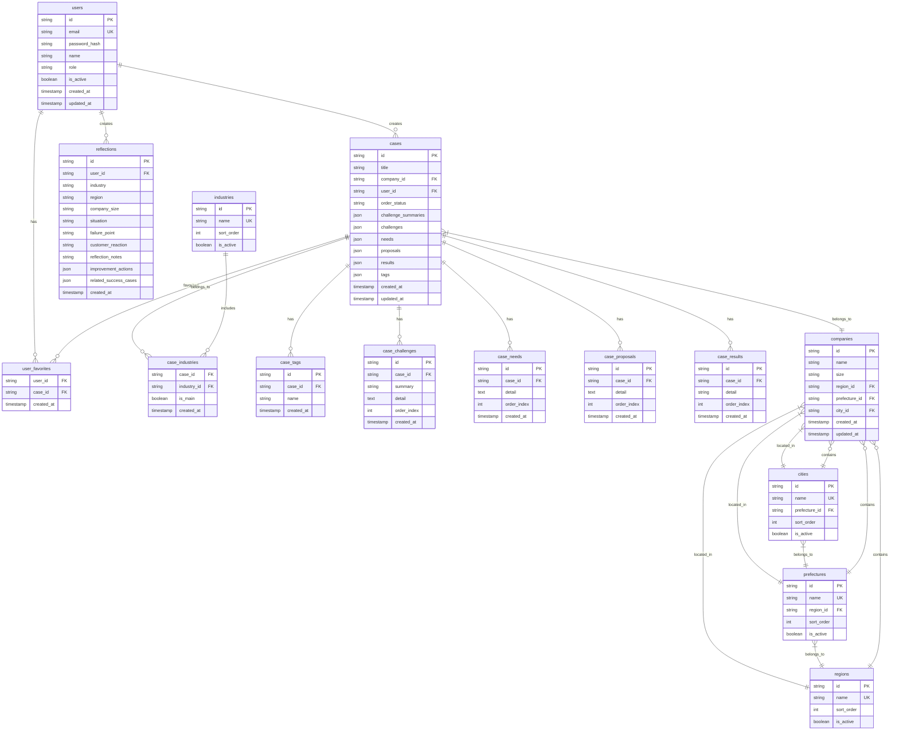

# データベース設計書

## ER図



## テーブル設計詳細

### 1. users（ユーザー）
営業担当者やシステムユーザーを管理

| カラム名 | データ型 | 制約 | 説明 |
|---------|---------|------|------|
| id | VARCHAR(36) | PRIMARY KEY | UUID |
| email | VARCHAR(255) | UNIQUE, NOT NULL | メールアドレス |
| password_hash | VARCHAR(255) | NOT NULL | ハッシュ化パスワード |
| name | VARCHAR(100) | NOT NULL | 氏名 |
| role | VARCHAR(20) | NOT NULL | 権限(admin, user) |
| is_active | BOOLEAN | DEFAULT TRUE | アクティブ状態 |
| created_at | TIMESTAMP | DEFAULT CURRENT_TIMESTAMP | 作成日時 |
| updated_at | TIMESTAMP | DEFAULT CURRENT_TIMESTAMP ON UPDATE CURRENT_TIMESTAMP | 更新日時 |

### 2. companies（会社）
顧客企業情報を管理

| カラム名 | データ型 | 制約 | 説明 |
|---------|---------|------|------|
| id | VARCHAR(36) | PRIMARY KEY | UUID |
| name | VARCHAR(255) | NOT NULL | 会社名 |
| size | VARCHAR(20) | NOT NULL | 会社規模(small, medium, large) |
| region_id | VARCHAR(36) | FOREIGN KEY | 地域ID |
| prefecture_id | VARCHAR(36) | FOREIGN KEY | 都道府県ID |
| city_id | VARCHAR(36) | FOREIGN KEY | 市区町村ID |
| created_at | TIMESTAMP | DEFAULT CURRENT_TIMESTAMP | 作成日時 |
| updated_at | TIMESTAMP | DEFAULT CURRENT_TIMESTAMP ON UPDATE CURRENT_TIMESTAMP | 更新日時 |

### 3. cases（営業事例）
営業事例の基本情報を管理

| カラム名 | データ型 | 制約 | 説明 |
|---------|---------|------|------|
| id | VARCHAR(36) | PRIMARY KEY | UUID |
| title | VARCHAR(255) | NOT NULL | 事例タイトル |
| company_id | VARCHAR(36) | FOREIGN KEY | 会社ID |
| user_id | VARCHAR(36) | FOREIGN KEY | 作成者ID |
| order_status | VARCHAR(20) | NOT NULL | 受注状況(won, lost, in_progress) |
| challenge_summaries | JSON | NULL | 課題要約配列 |
| challenges | JSON | NULL | 詳細課題配列 |
| needs | JSON | NULL | ニーズ配列 |
| proposals | JSON | NULL | 提案配列 |
| results | JSON | NULL | 結果配列 |
| tags | JSON | NULL | タグ配列 |
| created_at | TIMESTAMP | DEFAULT CURRENT_TIMESTAMP | 作成日時 |
| updated_at | TIMESTAMP | DEFAULT CURRENT_TIMESTAMP ON UPDATE CURRENT_TIMESTAMP | 更新日時 |

### 4. reflections（振り返り）
営業の振り返り情報を管理

| カラム名 | データ型 | 制約 | 説明 |
|---------|---------|------|------|
| id | VARCHAR(36) | PRIMARY KEY | UUID |
| user_id | VARCHAR(36) | FOREIGN KEY | 作成者ID |
| industry | VARCHAR(100) | NOT NULL | 業界 |
| region | VARCHAR(100) | NOT NULL | 地域 |
| company_size | VARCHAR(20) | NOT NULL | 会社規模 |
| situation | TEXT | NOT NULL | 商談状況 |
| failure_point | TEXT | NOT NULL | 失敗ポイント |
| customer_reaction | TEXT | NOT NULL | 顧客反応 |
| reflection_notes | TEXT | NOT NULL | 振り返り内容 |
| improvement_actions | JSON | NULL | 改善アクション配列 |
| related_success_cases | JSON | NULL | 関連成功事例ID配列 |
| created_at | TIMESTAMP | DEFAULT CURRENT_TIMESTAMP | 作成日時 |

### 5. industries（業界マスター）
建設業界の分類を管理

| カラム名 | データ型 | 制約 | 説明 |
|---------|---------|------|------|
| id | VARCHAR(36) | PRIMARY KEY | UUID |
| name | VARCHAR(100) | UNIQUE, NOT NULL | 業界名 |
| sort_order | INT | DEFAULT 0 | 表示順 |
| is_active | BOOLEAN | DEFAULT TRUE | アクティブ状態 |

### 6. regions（地域マスター）
地域分類を管理

| カラム名 | データ型 | 制約 | 説明 |
|---------|---------|------|------|
| id | VARCHAR(36) | PRIMARY KEY | UUID |
| name | VARCHAR(50) | UNIQUE, NOT NULL | 地域名 |
| sort_order | INT | DEFAULT 0 | 表示順 |
| is_active | BOOLEAN | DEFAULT TRUE | アクティブ状態 |

### 7. prefectures（都道府県マスター）
都道府県を管理

| カラム名 | データ型 | 制約 | 説明 |
|---------|---------|------|------|
| id | VARCHAR(36) | PRIMARY KEY | UUID |
| name | VARCHAR(50) | UNIQUE, NOT NULL | 都道府県名 |
| region_id | VARCHAR(36) | FOREIGN KEY | 地域ID |
| sort_order | INT | DEFAULT 0 | 表示順 |
| is_active | BOOLEAN | DEFAULT TRUE | アクティブ状態 |

### 8. cities（市区町村マスター）
市区町村を管理

| カラム名 | データ型 | 制約 | 説明 |
|---------|---------|------|------|
| id | VARCHAR(36) | PRIMARY KEY | UUID |
| name | VARCHAR(100) | UNIQUE, NOT NULL | 市区町村名 |
| prefecture_id | VARCHAR(36) | FOREIGN KEY | 都道府県ID |
| sort_order | INT | DEFAULT 0 | 表示順 |
| is_active | BOOLEAN | DEFAULT TRUE | アクティブ状態 |

### 9. case_industries（事例-業界関連）
事例と業界の多対多関係を管理

| カラム名 | データ型 | 制約 | 説明 |
|---------|---------|------|------|
| case_id | VARCHAR(36) | FOREIGN KEY | 事例ID |
| industry_id | VARCHAR(36) | FOREIGN KEY | 業界ID |
| is_main | BOOLEAN | DEFAULT FALSE | 主要業界フラグ |
| created_at | TIMESTAMP | DEFAULT CURRENT_TIMESTAMP | 作成日時 |

**複合主キー**: (case_id, industry_id)

### 10. case_tags（事例タグ）
事例に付与されるタグを管理

| カラム名 | データ型 | 制約 | 説明 |
|---------|---------|------|------|
| id | VARCHAR(36) | PRIMARY KEY | UUID |
| case_id | VARCHAR(36) | FOREIGN KEY | 事例ID |
| name | VARCHAR(50) | NOT NULL | タグ名 |
| created_at | TIMESTAMP | DEFAULT CURRENT_TIMESTAMP | 作成日時 |

### 11. case_challenges（課題情報）
事例の課題詳細を管理

| カラム名 | データ型 | 制約 | 説明 |
|---------|---------|------|------|
| id | VARCHAR(36) | PRIMARY KEY | UUID |
| case_id | VARCHAR(36) | FOREIGN KEY | 事例ID |
| summary | VARCHAR(255) | NOT NULL | 課題要約 |
| detail | TEXT | NOT NULL | 課題詳細 |
| order_index | INT | DEFAULT 0 | 表示順 |
| created_at | TIMESTAMP | DEFAULT CURRENT_TIMESTAMP | 作成日時 |

### 12. case_needs（ニーズ情報）
事例のニーズ詳細を管理

| カラム名 | データ型 | 制約 | 説明 |
|---------|---------|------|------|
| id | VARCHAR(36) | PRIMARY KEY | UUID |
| case_id | VARCHAR(36) | FOREIGN KEY | 事例ID |
| detail | TEXT | NOT NULL | ニーズ詳細 |
| order_index | INT | DEFAULT 0 | 表示順 |
| created_at | TIMESTAMP | DEFAULT CURRENT_TIMESTAMP | 作成日時 |

### 13. case_proposals（提案情報）
事例の提案詳細を管理

| カラム名 | データ型 | 制約 | 説明 |
|---------|---------|------|------|
| id | VARCHAR(36) | PRIMARY KEY | UUID |
| case_id | VARCHAR(36) | FOREIGN KEY | 事例ID |
| detail | TEXT | NOT NULL | 提案詳細 |
| order_index | INT | DEFAULT 0 | 表示順 |
| created_at | TIMESTAMP | DEFAULT CURRENT_TIMESTAMP | 作成日時 |

### 14. case_results（結果情報）
事例の結果詳細を管理

| カラム名 | データ型 | 制約 | 説明 |
|---------|---------|------|------|
| id | VARCHAR(36) | PRIMARY KEY | UUID |
| case_id | VARCHAR(36) | FOREIGN KEY | 事例ID |
| detail | VARCHAR(255) | NOT NULL | 結果詳細 |
| order_index | INT | DEFAULT 0 | 表示順 |
| created_at | TIMESTAMP | DEFAULT CURRENT_TIMESTAMP | 作成日時 |

### 15. user_favorites（お気に入り）
ユーザーのお気に入り事例を管理

| カラム名 | データ型 | 制約 | 説明 |
|---------|---------|------|------|
| user_id | VARCHAR(36) | FOREIGN KEY | ユーザーID |
| case_id | VARCHAR(36) | FOREIGN KEY | 事例ID |
| created_at | TIMESTAMP | DEFAULT CURRENT_TIMESTAMP | 作成日時 |

**複合主キー**: (user_id, case_id)

## インデックス設計

### 基本インデックス
```sql
-- 事例検索用
CREATE INDEX idx_cases_order_status ON cases(order_status);
CREATE INDEX idx_cases_created_at ON cases(created_at DESC);
CREATE INDEX idx_cases_user_id ON cases(user_id);
CREATE INDEX idx_cases_company_id ON cases(company_id);

-- 会社検索用
CREATE INDEX idx_companies_region_id ON companies(region_id);
CREATE INDEX idx_companies_prefecture_id ON companies(prefecture_id);
CREATE INDEX idx_companies_city_id ON companies(city_id);
CREATE INDEX idx_companies_size ON companies(size);

-- タグ検索用
CREATE INDEX idx_case_tags_name ON case_tags(name);
CREATE INDEX idx_case_tags_case_id ON case_tags(case_id);

-- 業界検索用
CREATE INDEX idx_case_industries_industry_id ON case_industries(industry_id);
CREATE INDEX idx_case_industries_is_main ON case_industries(is_main);

-- お気に入り検索用
CREATE INDEX idx_user_favorites_user_id ON user_favorites(user_id);

-- 全文検索用（MySQL 8.0以降）
CREATE FULLTEXT INDEX idx_cases_title ON cases(title);
```

### 複合インデックス
```sql
-- 高速検索用複合インデックス
CREATE INDEX idx_cases_status_created ON cases(order_status, created_at DESC);
CREATE INDEX idx_cases_user_status ON cases(user_id, order_status);
CREATE INDEX idx_companies_location ON companies(region_id, prefecture_id, city_id);
CREATE INDEX idx_case_industries_main ON case_industries(industry_id, is_main);
```

## データ整合性制約

### 外部キー制約
```sql
-- 事例テーブル
ALTER TABLE cases ADD FOREIGN KEY (company_id) REFERENCES companies(id) ON DELETE CASCADE;
ALTER TABLE cases ADD FOREIGN KEY (user_id) REFERENCES users(id) ON DELETE CASCADE;

-- 会社テーブル
ALTER TABLE companies ADD FOREIGN KEY (region_id) REFERENCES regions(id);
ALTER TABLE companies ADD FOREIGN KEY (prefecture_id) REFERENCES prefectures(id);
ALTER TABLE companies ADD FOREIGN KEY (city_id) REFERENCES cities(id);

-- 地域階層
ALTER TABLE prefectures ADD FOREIGN KEY (region_id) REFERENCES regions(id);
ALTER TABLE cities ADD FOREIGN KEY (prefecture_id) REFERENCES prefectures(id);

-- 関連テーブル
ALTER TABLE case_industries ADD FOREIGN KEY (case_id) REFERENCES cases(id) ON DELETE CASCADE;
ALTER TABLE case_industries ADD FOREIGN KEY (industry_id) REFERENCES industries(id);
ALTER TABLE case_tags ADD FOREIGN KEY (case_id) REFERENCES cases(id) ON DELETE CASCADE;
ALTER TABLE case_challenges ADD FOREIGN KEY (case_id) REFERENCES cases(id) ON DELETE CASCADE;
ALTER TABLE case_needs ADD FOREIGN KEY (case_id) REFERENCES cases(id) ON DELETE CASCADE;
ALTER TABLE case_proposals ADD FOREIGN KEY (case_id) REFERENCES cases(id) ON DELETE CASCADE;
ALTER TABLE case_results ADD FOREIGN KEY (case_id) REFERENCES cases(id) ON DELETE CASCADE;
ALTER TABLE user_favorites ADD FOREIGN KEY (user_id) REFERENCES users(id) ON DELETE CASCADE;
ALTER TABLE user_favorites ADD FOREIGN KEY (case_id) REFERENCES cases(id) ON DELETE CASCADE;
ALTER TABLE reflections ADD FOREIGN KEY (user_id) REFERENCES users(id) ON DELETE CASCADE;
```

### チェック制約
```sql
-- 受注状況の制約
ALTER TABLE cases ADD CONSTRAINT chk_order_status 
CHECK (order_status IN ('won', 'lost', 'in_progress'));

-- 会社規模の制約
ALTER TABLE companies ADD CONSTRAINT chk_company_size 
CHECK (size IN ('small', 'medium', 'large'));

-- ユーザー権限の制約
ALTER TABLE users ADD CONSTRAINT chk_user_role 
CHECK (role IN ('admin', 'user'));
```

## パフォーマンス最適化

### パーティショニング
大量データに対応するため、事例テーブルを年月でパーティショニング
```sql
-- 事例テーブルのパーティショニング（MySQL 8.0）
ALTER TABLE cases PARTITION BY RANGE (YEAR(created_at)) (
    PARTITION p2024 VALUES LESS THAN (2025),
    PARTITION p2025 VALUES LESS THAN (2026),
    PARTITION p2026 VALUES LESS THAN (2027),
    PARTITION pmax VALUES LESS THAN MAXVALUE
);
```

### 検索最適化
- JSON型カラムには仮想列を使用してインデックス作成
- 全文検索にはMySQL 8.0のFULLTEXT機能を活用
- 頻繁なクエリにはマテリアライズドビューを検討

## セキュリティ考慮事項

### データ暗号化
- 機密情報（パスワード等）はハッシュ化して保存
- 必要に応じてカラムレベル暗号化を実装

### アクセス制御
- ユーザー権限に基づくRow Level Security
- 監査ログの実装（誰がいつ何をしたか）

### バックアップ戦略
- 日次フルバックアップ
- トランザクションログのリアルタイムバックアップ
- Point-in-Time Recovery対応