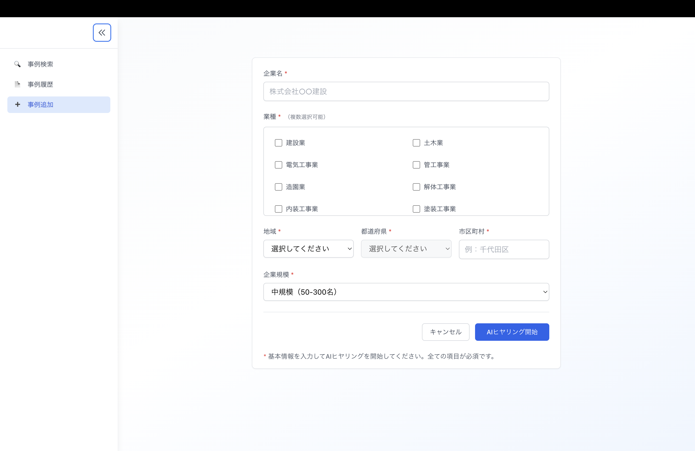
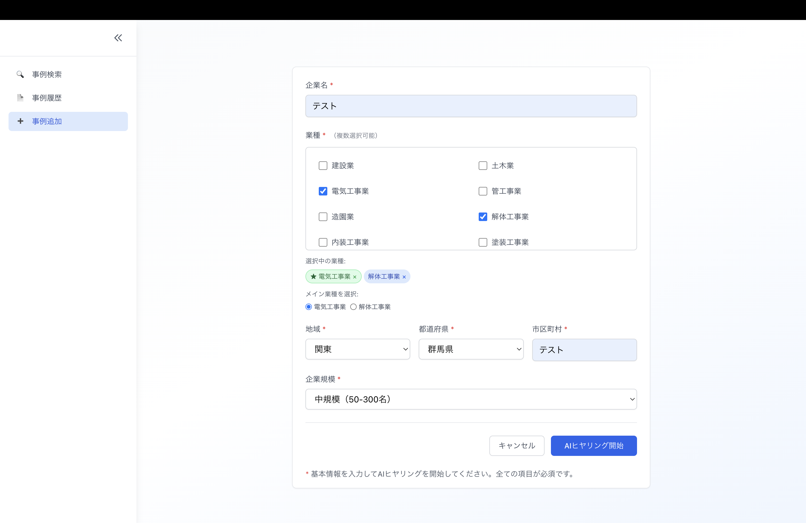
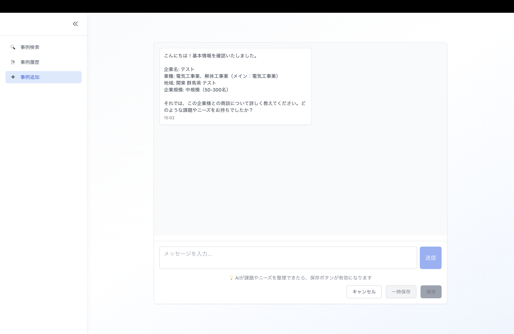
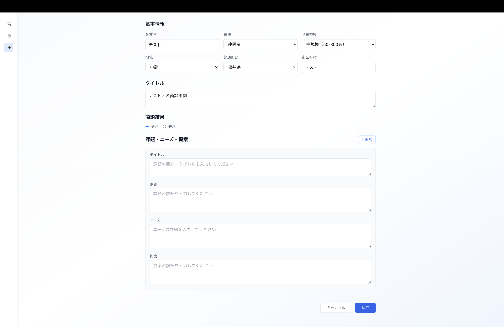

# 事例作成画面仕様書

## 画面概要
AIヒヤリング機能を使用して新規商談事例を作成する画面。基本情報入力から始まり、AIとの対話を通じて事例を構築。

## 画面

## 機能仕様

### 1. 基本情報入力画面
- **企業名**: テキスト入力（必須）
- **業種**: 建設業界29業種から選択（複数選択可）
  - 建設業、土木業、電気工事業、管工事業、解体工事業、内装工事業、塗装工事業
- **地域**: 都道府県選択
- **市区町村**: テキスト入力
- **企業規模**: 小規模（〜50名）、中規模（50-300名）、大規模（300名〜）
- **メイン業種**: ラジオボタンで1つ選択

#### アクション
- **AIヒヤリング開始**: チャット画面へ遷移
- **キャンセル**: 事例検索画面へ遷移

### 2. AIヒヤリング画面
- チャット形式でAIと対話
- AIが質問を投げかけ、ユーザーが回答
- 課題・ニーズ・提案を順次ヒアリング
- **送信ボタン**: メッセージ送信
- **保存ボタン**: 事例セット作成後に有効化
- **一時保存**: 非公開ステータスで保存
- **キャンセル**: 事例検索画面へ遷移

### 3. 内容確認画面
- 作成した事例内容の確認
- **タイトル**: 自動生成されたタイトル（編集可）
- **商談結果**: 受注/失注をラジオボタンで選択
- **課題・ニーズ・提案**: 各項目の内容確認（+追加ボタンで項目追加可）
- **保存**: 公開ステータスで保存
- **キャンセル**: AIヒヤリング画面へ戻る

### 4. 保存仕様
- **一時保存**:
  - ステータス: 非公開（進行中）
  - 事例履歴画面でのみ確認可能
  - 後からヒヤリング再開可能
- **保存（公開）**:
  - ステータス: 公開（受注/失注）
  - 事例検索画面で検索可能
  - 他ユーザーも閲覧可能