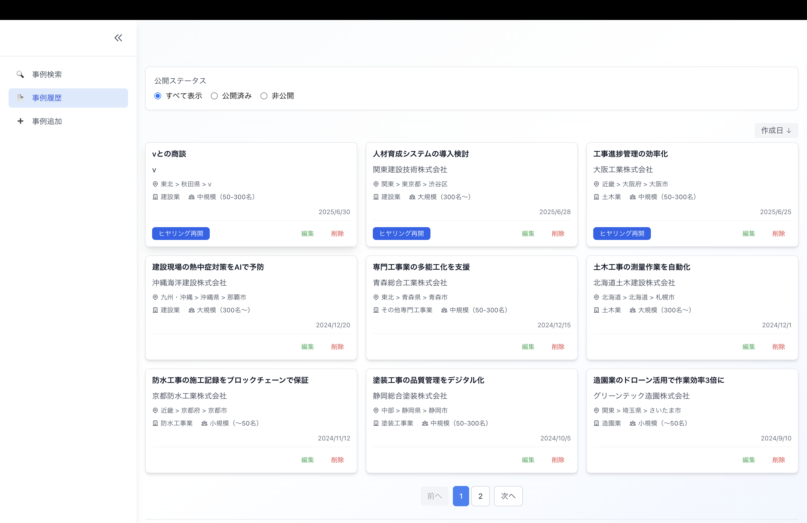
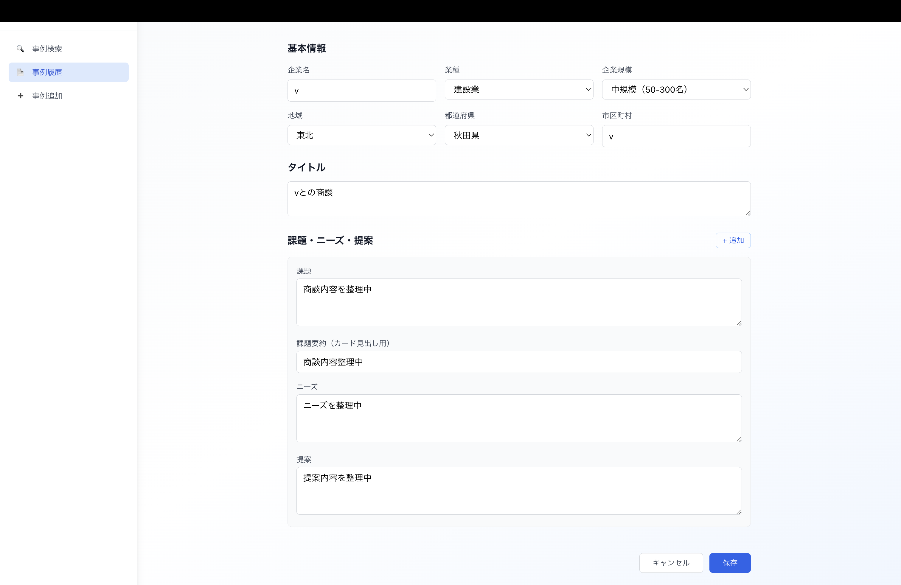
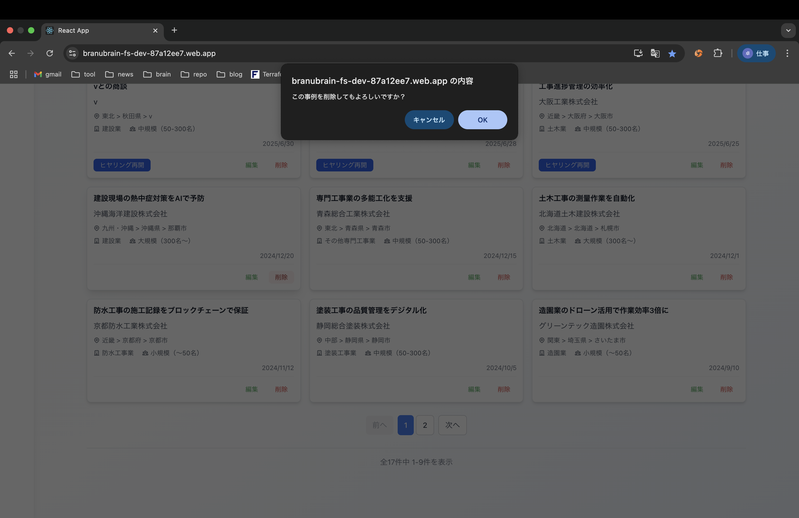
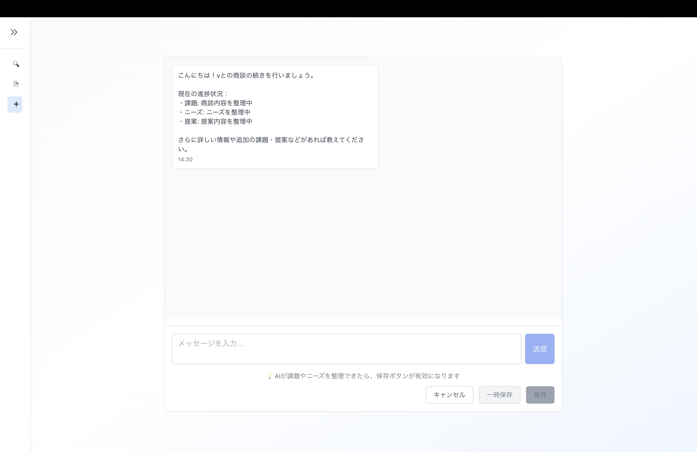

# 事例履歴画面仕様書

## 画面概要
自分が登録した商談事例を管理する画面。公開ステータスの切り替えや編集・削除が可能。

## 画面

## 機能仕様

### 1. 表示切り替え
- **公開ステータス**:
  - すべて表示
  - 公開済み（受注/失注）
  - 非公開（進行中）
- ラジオボタンで選択

### 2. 事例カード機能
- **ヒヤリング再開ボタン**: 非公開ステータスの事例のみ表示
- **編集ボタン**: 編集画面へ遷移
- **削除ボタン**: 削除確認アラート表示

### 3. 編集機能
- 基本情報（企業名、業種、地域、規模、市区町村）の編集
- タイトルの編集
- 課題・ニーズ・提案の編集（+追加ボタンで項目追加）
- **保存ボタン**: 更新を保存して履歴画面へ戻る
- **キャンセルボタン**: 変更を破棄して履歴画面へ戻る

### 4. 削除機能
- 確認ダイアログ: 「この事例を削除してもよろしいですか？」
- OKボタン: 削除実行
- キャンセルボタン: 削除中止

### 5. AIヒヤリング再開
- 非公開（進行中）の事例のみ利用可能
- ヒヤリング再開ボタンクリックでAI機能を再開
- 課題・ニーズの追加や提案の最適化が可能

### 6. 表示仕様
- ページネーション: 最大9件/ページ
- 作成日の新しい順で表示