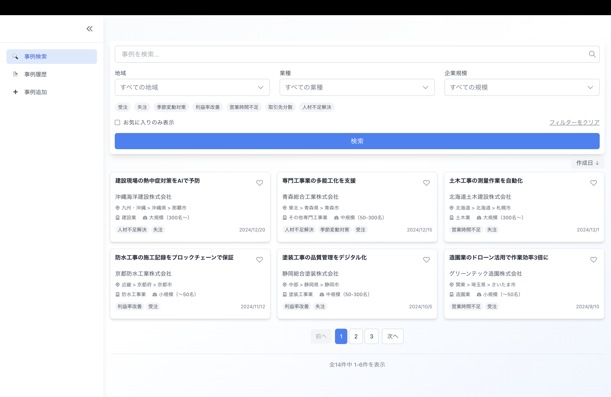
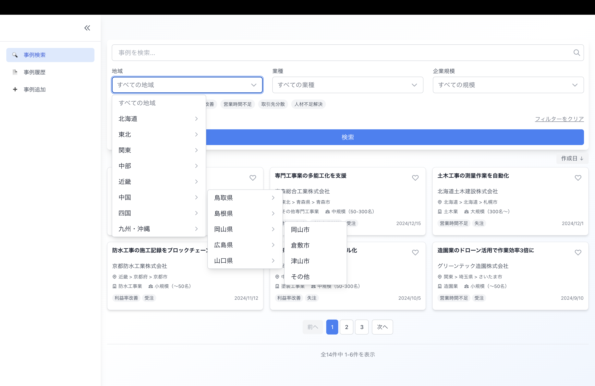
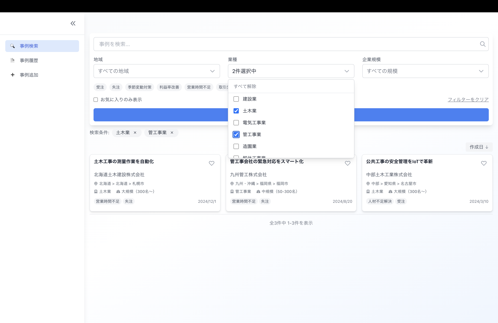
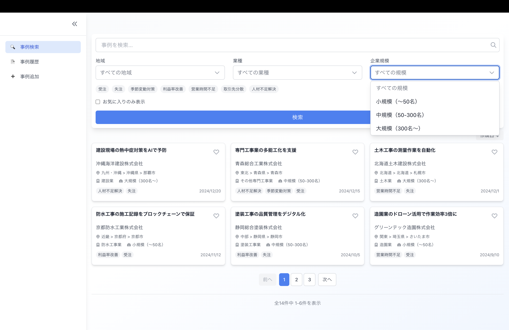
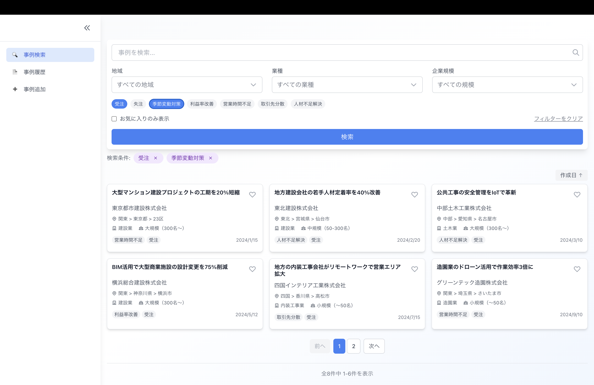
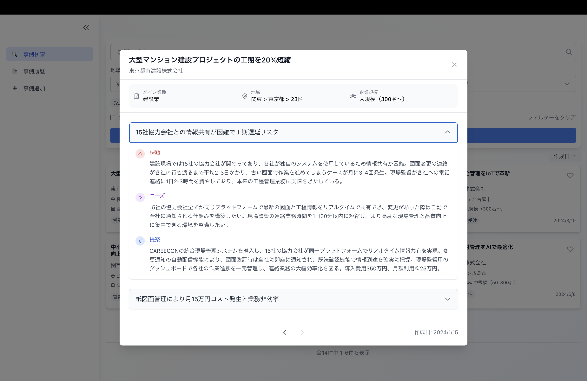

# 事例検索画面仕様書

## 画面概要
商談事例を検索・閲覧するメイン画面。多様な条件で絞り込み検索が可能。

## 画面

## 機能仕様

### 1. 検索機能
- **キーワード検索**: フリーテキストで企業名、課題、ニーズ、提案内容を検索
- **地域検索**: 
  - 都道府県レベル（デフォルト）
  - 市区町村レベル（登録されている場合のみ表示）
  - 新規登録時に市区町村が追加されたらDBに保存し検索可能に
- **業種検索**: 建設業界29業種で絞り込み
- **企業規模検索**: 小規模（〜50名）、中規模（50-300名）、大規模（300名〜）

### 2. タグフィルター
- 受注/失注
- 季節変動対策
- 利益率改善
- 営業時間不足
- 取引先分散
- 人材不足解決
- タグ選択で絞り込み、タグの×ボタンで解除

### 3. 表示オプション
- **お気に入りのみ表示**: チェックボックスで切り替え
- **並び替え**: 作成日の新しい順/古い順
- **ページネーション**: 最大9件/ページ

### 4. 事例詳細表示（ポップアップ）
- **ヘッダー情報**: タイトル、検索条件（企業情報）、タグ
- **事例内容**: 
  - 複数の課題/ニーズ/提案をアコーディオン形式で表示
  - デフォルトは全て閉じた状態
  - クリックで展開
- **表示ルール**:
  - 受注案件: 課題/ニーズ/提案を表示
  - 失注案件: 課題/ニーズのみ表示
- **ナビゲーション**: < > ボタンで前後の事例へ移動

### 5. お気に入り機能
- ハートアイコンクリックで登録/解除
- ユーザーごとに保存