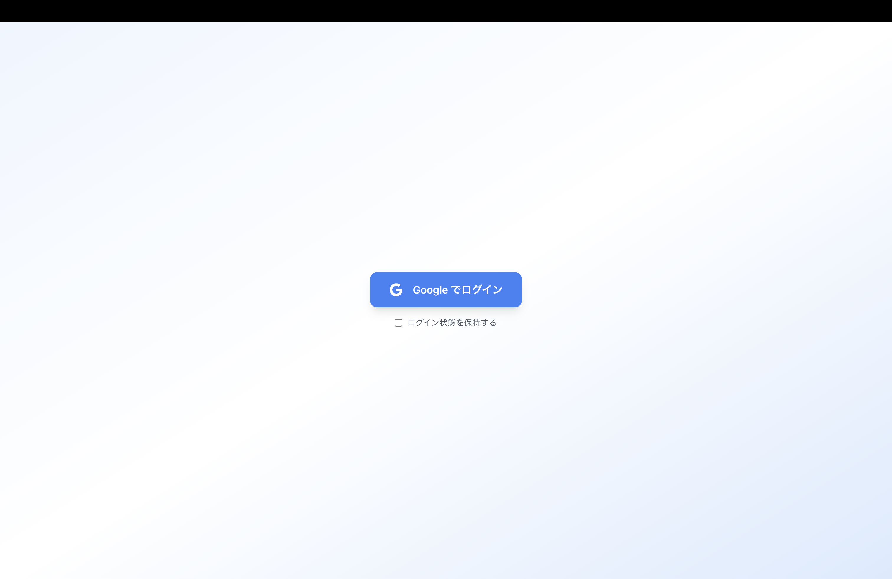

# ログイン画面仕様書

## 画面概要
営業支援ツールへの入り口となる認証画面。AWS CognitoとGoogle OAuth 2.0を使用したシングルサインオン（SSO）を提供する。

## 画面

## デザイン仕様

### 1. Googleログインボタン
- **位置**: 画面中央
- **テキスト**: "Googleでログイン"
- **アイコン**: Google公式ロゴ（左側配置）
- **スタイル**:
  - 背景色: #4285F4 (Google Blue)
  - テキスト色: #FFFFFF
  - パディング: 12px 24px
  - ボーダー半径: 4px
  - シャドウ: 0 2px 4px rgba(0,0,0,0.1)
  - ホバー時: 背景色を#3367D6に変更
  - アクティブ時: scale(0.98)

### 2. ログイン状態保持チェックボックス
- **位置**: ログインボタン下部（8px間隔）
- **ラベル**: "ログイン状態を保持する"
- **デフォルト**: チェックなし

## 機能仕様
1. **初回アクセス**
   - ユーザーが「Googleでログイン」ボタンをクリック
   - AWS Cognitoを利用した認証後にトップ画面（事例検索画面）へリダイレクト

2. **ログイン状態保持**
   - チェックボックスON時:
     - Refresh Tokenを使用した長期認証
     - ローカルストレージにトークンを保存
   - チェックボックスOFF時:
     - セッションストレージにトークンを保存
     - ブラウザを閉じるとログアウト

