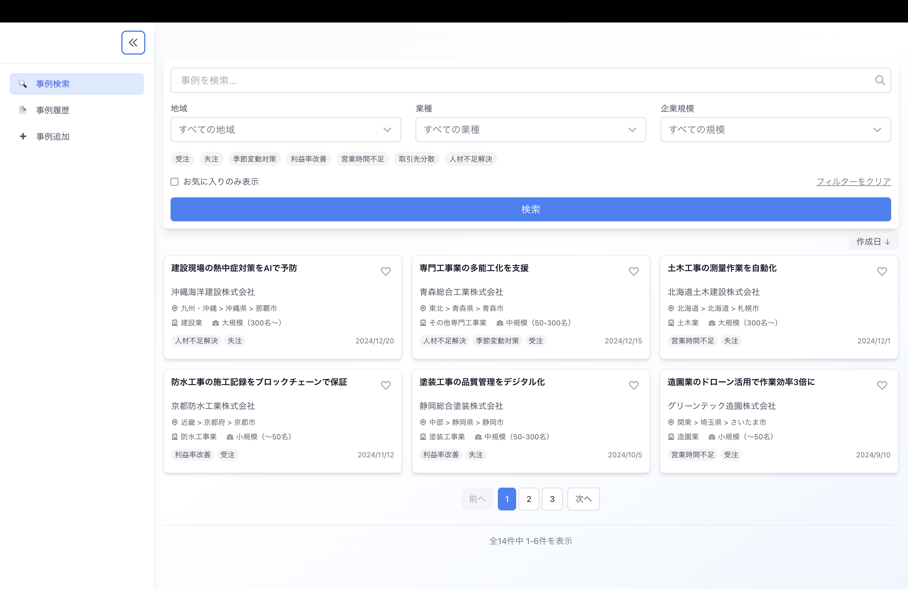
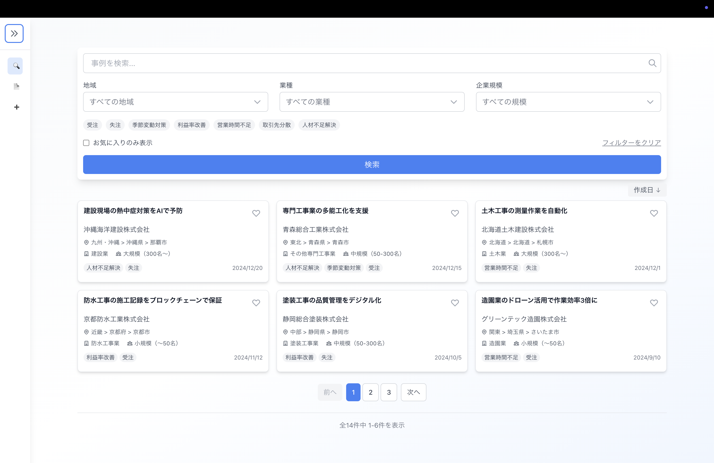

# サイドバー仕様書

## 概要
全画面共通で表示される左側のナビゲーションメニュー。

## 画面

## 機能仕様

### 1. メニュー構成
- **事例検索**: 事例一覧画面へ遷移
- **事例履歴**: 閲覧履歴画面へ遷移
- **事例追加** (+ボタン): 事例作成画面へ遷移

### 2. 開閉機能
- **«ボタン**: クリックでサイドバーを折りたたみ/展開
- 折りたたみ時: アイコンのみ表示
- 展開時: アイコン＋テキスト表示

### 3. デザイン仕様
- 幅: 200px（固定）
- 背景色: #F3F4F6
- アクティブメニュー: 青色ハイライト表示

### 4. インタラクション
- メニュークリックで各画面へ遷移
- 現在の画面に対応するメニューをアクティブ表示
- ホバー時: 背景色を薄い青に変更

### 5. レスポンシブ対応
- モバイル（〜768px）: ハンバーガーメニューに変更
- タブレット以上: 常時表示

